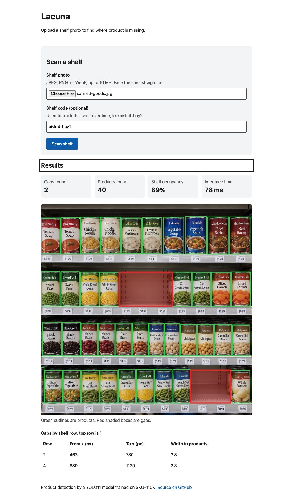
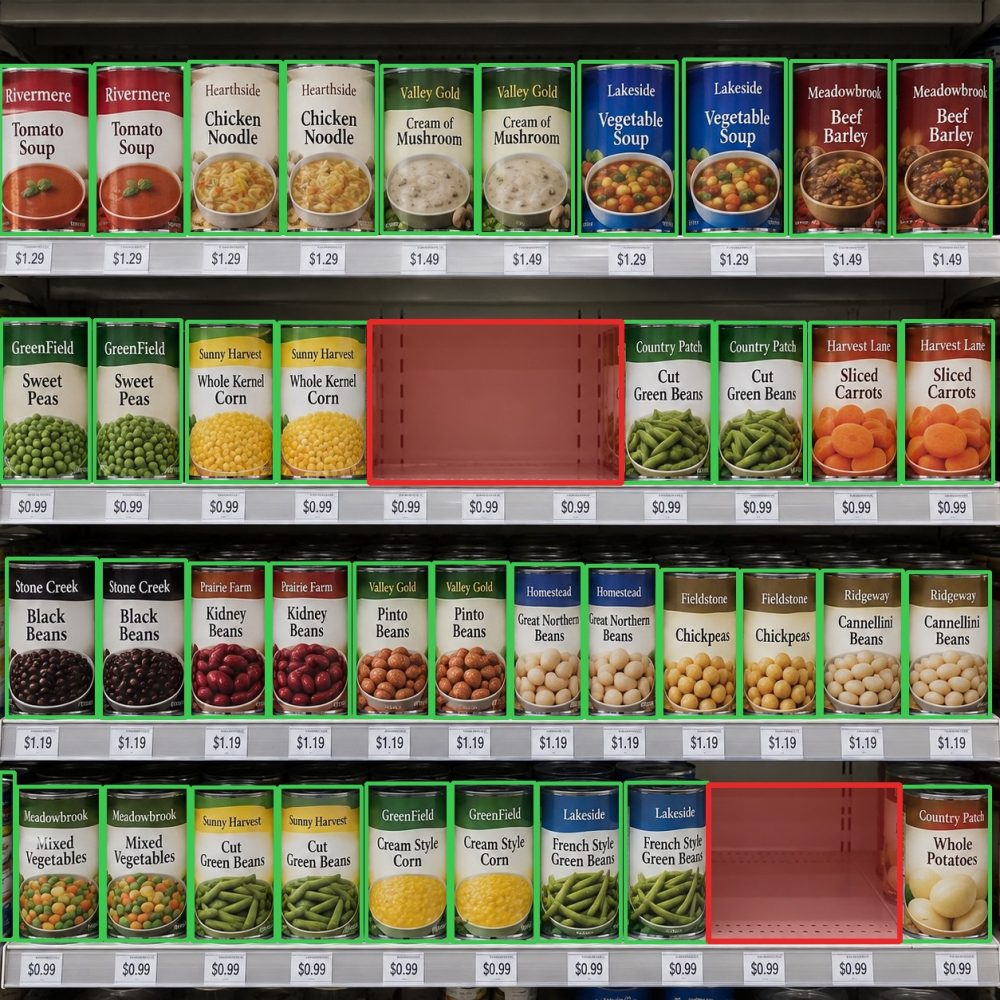
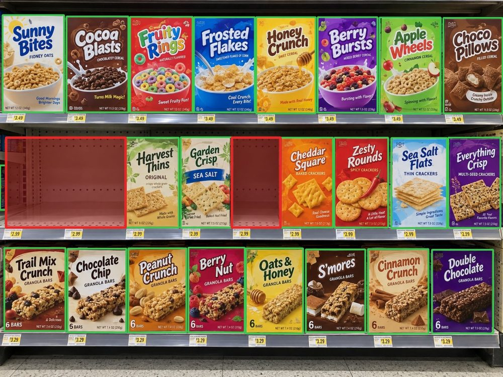
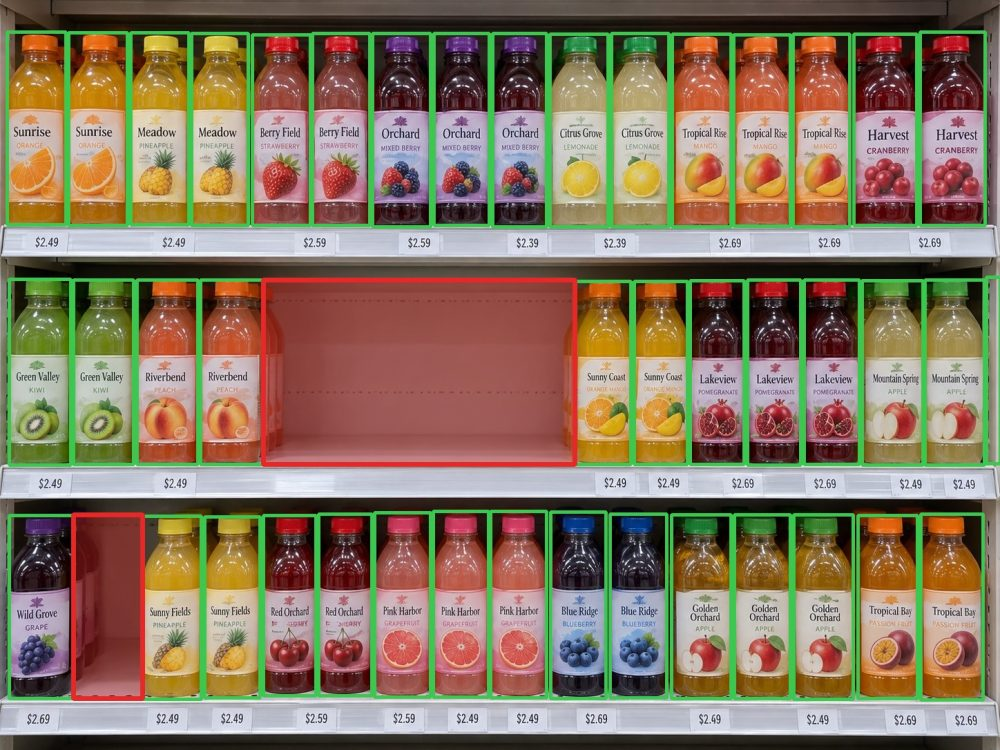

# Lacuna

[](https://github.com/ianmcchristian/lacuna/actions/workflows/ci.yml)

Finds empty shelf space in retail shelf photos.

Upload a shelf photo, and Lacuna detects every product, groups them into shelf
rows, and flags the holes where product is missing. Every scan is saved to
Postgres, so you can track a shelf over time and rank which shelves need a
restock first.

*lacuna (Latin): a gap, the missing piece.*

**Try it:** [upload UI](https://ianmcchristian.github.io/lacuna/) ·
[API docs](https://lacuna-mp1n.onrender.com/docs). By default the UI runs the
model in your browser, so a scan takes about half a second and the photo never
leaves your device. The other option sends it to the API, which saves the scan
but runs on a free instance with a tenth of a CPU, so it takes several seconds.



## Demo

Green boxes are products, red boxes are gaps. These shelf photos are
**AI-generated** (made up for this demo, no real brands), and each was made with
known empty spots so the output can be checked against them.

| Canned goods | Cereal | Bottles |
|---|---|---|
|  |  |  |
| 40 products, 2 gaps | 23 products, 2 gaps | 43 products, 2 gaps |

All 6 holes are found, with no false gaps. Two of them are a single product
wide (0.93x and 1.24x the median product width), which is why the threshold is
0.8x and not something looser like 1.5x: at 1.5x only 4 of 6 are found. These
images are a regression test in CI (`tests/test_model.py`).

### Harder scenarios

Eight more AI-generated shelves, each made to test one thing. Five work, three
don't, and the misses are kept here on purpose. All 11 photos are one click
away in the live UI under "Or try a sample shelf", with the failures marked.

| Scenario | Result | |
|---|---|---|
| [Fully stocked](docs/scenarios/fully-stocked.overlay.jpg) | 42 products, **0 gaps** | Correct. No false alarms on a full shelf |
| [Depleted](docs/scenarios/depleted.overlay.jpg) | **6/6 gaps**, 48% occupancy | Correct |
| [Mixed sizes](docs/scenarios/mixed-sizes.overlay.jpg) | **2/2 gaps** | Correct. 12 oz cans and 2 L bottles stay in one row |
| [Cooler glare](docs/scenarios/cooler-glare.overlay.jpg) | **1/1 gap** | Correct. Bottles washed out by glare still detected |
| [Low light](docs/scenarios/low-light.overlay.jpg) | **1/1 gap** | Correct |
| [Messy](docs/scenarios/messy.overlay.jpg) | 1/1 gap, **1 false** | Boxes knocked onto their side aren't detected, so they read as a hole |
| [Empty row](docs/scenarios/empty-row.overlay.jpg) | 0/1, **2 false** | A fully empty shelf has no products to anchor it. The model also splits some tall cereal boxes into a top and bottom half |
| [Angled](docs/scenarios/angled.overlay.jpg) | 1/1 gap, **3 false** | Shelves slant in perspective, so rows can't be grouped by height |

The first run of these found a bug: three photos had a sliver of the next
shelf cut off by the bottom of the frame, and that sliver came back as one
long "gap". Rows that are mostly cut off by the top or bottom of the photo
are now skipped, which removed all five of those false gaps and changed
nothing else. The five correct scenarios are regression tests too.

## INT8 quantization

The deployed model is an INT8 copy of YOLO11s made with ONNX Runtime static
quantization ([`scripts/quantize.py`](scripts/quantize.py), built into the
Docker image). Same 11 shelves, 1 CPU thread, M-series Mac
([`scripts/benchmark.py`](scripts/benchmark.py)):

| Model | Size | Median latency | Boxes matched (recall / precision) | Gap tests |
|---|---|---|---|---|
| YOLO11s fp32 (baseline) | 37.9 MB | 257 ms | 100% / 100% | 8/8 |
| **YOLO11s INT8 (deployed)** | **10.2 MB** | **87 ms** | 99.3% / 97.3% | **8/8** |
| YOLO11n fp32 | 10.6 MB | 92 ms | 90.3% / 91.9% | 7/8 |

3x faster and 3.7x smaller than the model it came from, with the same gap
results. It's as fast as the nano model without losing what the small model
was picked for. With every core it's 28 ms vs 72 ms. There are no hand-labelled
boxes, so "boxes matched" is agreement with the fp32 model at IoU 0.5.

Getting there took two fixes:

- **The first INT8 model found nothing.** YOLO's last layer concatenates box
  coordinates (0-640 px) and scores (0-1) into one tensor. One INT8 scale over
  both rounds every score to zero. Keeping that decode step in float fixed it.
- **Calibration data mattered more than the method.** Calibrating on the 3 demo
  shelves passed 5-7 of 8 gap tests. In canned-goods it saw a product in the
  middle of a 3-can hole. Calibrating on the 3 hard-case shelves passed 8 of 8
  with every method tried (MinMax, percentile, entropy). Those 3 aren't
  regression tests, so INT8 is never graded on a photo it was calibrated on.

Every model test runs on both the fp32 and INT8 models in CI.

## In-browser inference

The UI can run the whole pipeline client-side with
[ONNX Runtime Web](https://onnxruntime.ai/docs/tutorials/web/) (WASM). The
10 MB INT8 model is what makes this practical: the first scan downloads about
25 MB (model plus runtime), and that only happens when someone picks browser
mode. The page itself is 50 KB gzipped.

Letterboxing, decoding, NMS, and the gap logic are ported to TypeScript
([`web/src/inference/`](web/src/inference/)). Two implementations of the same
logic can drift, so a Playwright test runs the real model in Chromium on all 8
regression shelves and checks it finds the same gaps as Python, within the same
25 px. The gap logic's unit tests are ported too.

| | Browser (Chromium, M-series Mac) | API on Render's free plan |
|---|---|---|
| Inference | ~550 ms | several seconds |
| First scan | ~1.7 s (loads runtime + model) | up to a minute if the instance is asleep |
| Photo uploaded | No | Yes, and saved with the scan |
| Shelf history | No | Yes |

Threads stay at 1: multi-threaded WASM needs cross-origin isolation headers,
and GitHub Pages can't send them.

## How it works

```
photo -> letterbox 640x640 -> YOLO11s (ONNX Runtime) -> NMS -> product boxes
      -> group boxes into shelf rows -> walk each row for holes -> gaps + occupancy
      -> Postgres (images, scans, detections, gaps) -> SQL reports
```

1. **Detect products.** A YOLO11s model fine-tuned on
   [SKU-110K](https://github.com/eg4000/SKU110K_CVPR19) (dense retail shelves)
   runs on ONNX Runtime. Letterboxing and non-max suppression are written here
   in NumPy, so there's no PyTorch in the service.
2. **Group into rows.** Boxes are sorted top to bottom and joined into a row
   when they overlap it vertically by at least half their height. That keeps
   tall and short products on the same shelf together.
3. **Find gaps.** Each row is walked left to right. Any hole wider than
   `0.8x` the row's median product width is a gap. Normal spacing between
   products is about `0.1x`. Row ends are checked against the full shelf width,
   so an empty spot at the edge still counts.
4. **Score it.** Occupancy = `1 - gap width / shelf width` across every row
   checked.

## API

| Method | Path | What it does |
|---|---|---|
| `POST` | `/images` | Upload a jpeg, png, or webp (10 MB max). Optional `shelf` code like `aisle4-bay2` |
| `POST` | `/detect` | Run detection on an uploaded image, save the scan |
| `GET` | `/results/{scan_id}` | Products, gaps, occupancy, latency |
| `GET` | `/results/{scan_id}/overlay` | The photo with products in green, gaps in red |
| `GET` | `/shelves/{code}/history` | A shelf's scans over time, with the change vs the scan before |
| `GET` | `/reports/worst-shelves` | Shelves ranked by occupancy on their latest scan |
| `GET` | `/health` | Liveness |
| `GET` | `/ready` | Readiness: database reachable and model loaded |
| `GET` | `/metrics` | Prometheus metrics |

Interactive docs are at `/docs` once it's running.

```bash
curl -F file=@shelf.jpg -F shelf=aisle4-bay2 localhost:8000/images
curl -X POST localhost:8000/detect -H 'content-type: application/json' -d '{"image_id": "<id>"}'
```

The two reports are plain SQL in [`lacuna/db/reports.py`](lacuna/db/reports.py):
shelf history uses `LAG()` to get the occupancy change between scans, and worst
shelves uses `ROW_NUMBER()` to pick each shelf's latest scan before ranking.

## Run it

Needs Python 3.12 and [uv](https://docs.astral.sh/uv/).

```bash
uv sync
uv run python scripts/download_weights.py s      # ~38 MB, pinned revision + sha256
uv run python scripts/quantize.py                # optional: the INT8 copy the image uses
uv run alembic upgrade head                      # SQLite by default
uv run uvicorn lacuna.main:create_app --factory --reload
```

Try the model on a photo without the API:

```bash
uv run python scripts/annotate.py docs/demo/cereal.jpg   # writes cereal.overlay.jpg
```

The upload UI (React + TypeScript, Vite) lives in `web/`:

```bash
cd web && npm install
npm run dev          # localhost:5173, talks to the API on :8000
```

With Docker (API + Postgres + migrations):

```bash
docker compose up --build    # API on localhost:8080
```

Settings come from `LACUNA_*` environment variables. See `.env.example`.

### Kubernetes (local kind cluster)

`k8s/base` has the Deployment (2 replicas, startup/liveness/readiness probes,
non-root, read-only root filesystem), Service, HorizontalPodAutoscaler (2-6
replicas at 70% CPU), and a migration Job. `k8s/local` adds a throwaway
Postgres for kind.

```bash
kind create cluster --config k8s/local/kind.yaml
docker build -t lacuna:local . && kind load docker-image lacuna:local --name lacuna
kubectl apply -f https://github.com/kubernetes-sigs/metrics-server/releases/latest/download/components.yaml
kubectl -n kube-system patch deployment metrics-server --type=json \
  -p '[{"op":"add","path":"/spec/template/spec/containers/0/args/-","value":"--kubelet-insecure-tls"}]'
kubectl apply -k k8s/local
kubectl port-forward svc/lacuna 8080:80
```

Under load (8 clients looping on `/detect`), the HPA went from 2 to 6 replicas
in about 90 seconds at 190% of the CPU target.

## Tests

```bash
uv run pytest                                   # SQLite
LACUNA_TEST_DATABASE_URL=postgresql+psycopg://... uv run pytest   # Postgres, like CI
uv run ruff check . && uv run mypy lacuna tests scripts
cd web && npm test && npm run e2e               # UI: jsdom + real browser
```

63 Python tests (97% coverage) cover the API contract, upload edge cases (wrong
type, too big, empty, corrupt), the gap logic, pre/post-processing, the SQL
reports, Alembic migrations matching the models, and an upload being scanned by
a second app instance (a fresh replica). With the weights downloaded, they also
run the fp32 and INT8 models on 8 shelf photos, checking every hole's row and
position, and inpaint one bottle out of a full row to check the gap lands there.

20 Vitest tests cover the UI states in jsdom (with axe) and the TypeScript gap
logic. 13 Playwright tests run the production build in Chromium: accessibility,
the keyboard flow, and real in-browser scans of all 8 regression shelves
checked against the Python results. Browser e2e needs the INT8 model in
`models/` (see Run it).

CI runs all of it against Postgres 16, builds the Docker image, starts it, and
scans a demo shelf in the container, checking it runs the INT8 model and finds
both holes.

## Deployment

- **API:** Docker image on [Render](https://render.com)'s free plan
  ([`render.yaml`](render.yaml)). Once every check passes and the migration
  runs, CI triggers a deploy hook and waits until `/health` reports the new
  commit, so a deploy that never lands fails the build.
  The free plan sleeps after 15 minutes idle, so a scheduled workflow pings it.
- **Database:** Postgres on [Neon](https://neon.tech). CI runs the Alembic
  migration before each deploy.
- **UI:** static build on GitHub Pages ([`pages.yml`](.github/workflows/pages.yml)).

## Accessibility

The UI targets WCAG 2.2 AA: every input has a visible label and hint wired up
with `aria-describedby`, errors are announced and move focus to the field,
scan progress uses a live region, focus moves to the results when they load,
there's a skip link and a visible focus ring, buttons are at least 44x44 px,
and gaps are listed in a table so the result doesn't rely on color. Text
contrast is at least 6.67:1.

Playwright runs axe-core with every WCAG 2.2 AA rule (color contrast
included) in Chromium before and after a scan, in both modes, and drives the
whole flow by keyboard. Vitest runs axe again in jsdom on each component state.

## Design notes

- **ONNX Runtime, not PyTorch.** Inference only, so the runtime is a fraction
  of the size and the container starts faster. The image is about 540 MB and
  uses about 260 MB of RAM.
- **YOLO11s over YOLO11n.** On a glass-door cooler photo, n missed a can
  washed out by glare (score 0.15) and reported a fake gap. s caught it (0.33)
  and found 20 products to n's 15. INT8 then made s as fast as n (above).
- **Image bytes live in Postgres**, not on disk. With two replicas behind a
  Service, an upload can land on one pod and `/detect` on another, and free
  hosts wipe their disk on restart. Stored copies are capped at 2048 px; the
  model only sees 640.
- **Gap logic is only as good as detection recall.** A missed product looks
  exactly like a hole. That's the main failure mode.

## Limits

- A shelf row with no products at all has nothing to anchor it, so it isn't
  reported. Rows with only one product are skipped as noise, and so are rows
  cut off by the edge of the photo.
- Take the photo straight on. At a steep angle the shelves slant and rows
  can't be grouped (see the angled scenario).
- Products the model misses, like boxes knocked onto their side, read as
  holes.
- It finds *where* product is missing, not *which* product. Naming the missing
  item would need a product catalog or planogram.
- The test photos are synthetic. Real store photos will be harder.
- Small products in very large photos lose detail at 640x640.

## Credits and license

- Model: [chistopat/sku110k-yolo11-object-detector](https://huggingface.co/chistopat/sku110k-yolo11-object-detector),
  YOLO11 by [Ultralytics](https://github.com/ultralytics/ultralytics) (AGPL-3.0),
  trained on SKU-110K (Goldman et al., CVPR 2019). The weights carry the
  dataset's research terms.
- Demo shelf photos are AI-generated for this repo.
- This repo is licensed AGPL-3.0. See [LICENSE](LICENSE).
